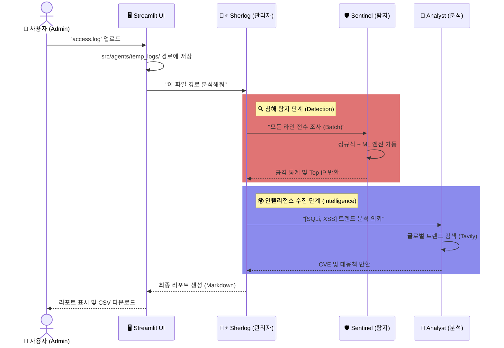
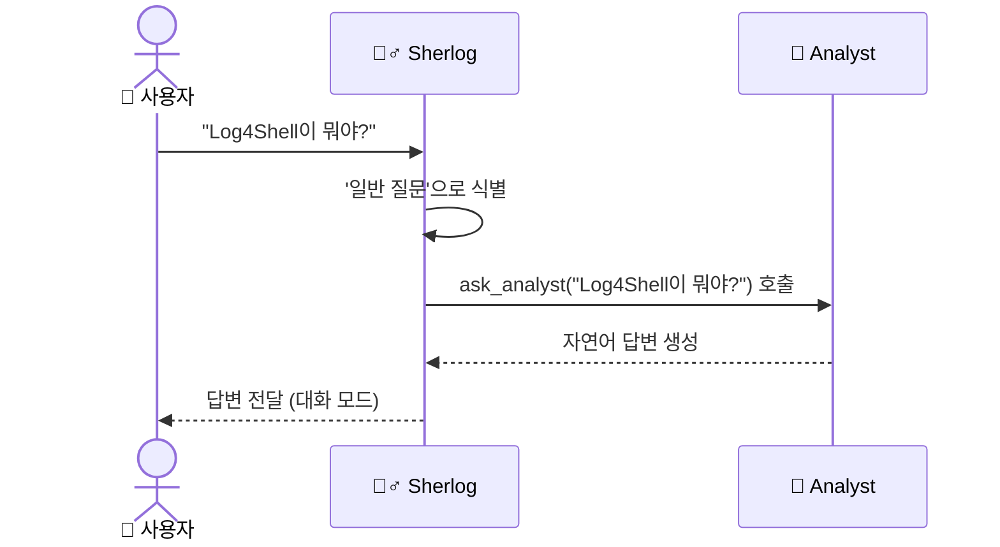

# 🕵️‍♂️ 셜log : AI Agent-Based Security Log Analysis

> **"로그 속의 범인을 찾아내는 지능형 보안 파트너, 셜log"**
> AiGIS 팀이 개발하는 이 시스템은 서버 및 웹 로그를 분석하여 침해 징후를 탐지하고, 보안 비전문가도 즉시 대응할 수 있는 가이드를 제공합니다.

---

## 👥 1. Team AiGIS
보안과 AI의 융합을 통해 더 안전한 네트워크 환경을 만드는 **AiGIS** 팀입니다.

* **팀장**: 고태완 (Frontend, OpenAI 연결 및 멀티에이전트 구현, 에이전트 개별 구현)
* **팀원**:
    * **노다원**: 모델링, 모델 평가 및 성능 개선
    * **최성우**: 데이터 수집, 데이터 전처리
    * **민순기**: 데이터 수집, 데이터 전처리
    * **추민호**: 데이터 수집, 데이터 전처리, 모델링, 모델 평가 및 성능 개선
    * **이채원**: 에이전트 개별 구현, OpenAI 연결 및 멀티에이전트 구현
    * **공지원**: 데이터 수집, 데이터 전처리

---

## 📖 2. Introduction
**셜log**는 단순한 로그 분석기를 넘어선 **"AI 보안 관제 요원"**입니다.
복잡한 방화벽 로그, 웹 접근 로그를 분석하여 **공격 여부를 1차 판단(Sentinel)**하고, 탐지된 위협에 대해 **최신 트렌드와 대응책을 조사(Analyst)**하여, 최종적으로 **관리자에게 브리핑(Sherlog)**하는 Full-Cycle 보안 솔루션입니다.

### 🚀 핵심 기능 (Key Features)
- **🔍 하이브리드 탐지 엔진 (Hybrid Detection)**: 정규식(Regex)의 정확성과 머신러닝(XGBoost)의 변칙 탐지 능력을 결합하여 미탐/오탐을 최소화합니다.
- **🧠 자동화된 위협 인텔리전스 (Threat Intelligence)**: 탐지된 공격(예: Log4Shell)에 대해 자동으로 최신 CVE 및 공격 트렌드를 웹에서 검색하여 보고서에 포함합니다.
- **🗣️ 대화형 챗봇 (Interactive Chat)**: 단순히 로그만 분석하는 것이 아니라, "요즘 보안 트렌드는?" 같은 일반적인 질문에도 답변 가능한 챗봇 기능을 제공합니다.
- **📊 전문적인 리포팅 (Reporting)**: 분석 결과는 CSV로 다운로드 가능하며, UI상에서 요약된 마크다운 리포트로 제공됩니다.

---

## ⚙️ 3. 시스템 워크플로우 및 아키텍처 (Architecture)
셜log는 3명의 전문 AI 에이전트가 협업하는 **Swarm Architecture**를 채택했습니다.

### 🏗 멀티 에이전트 구조 (Multi-Agent)
1. **Sherlog (관리자)**: 사용자와 소통하며 전체 분석 흐름을 지휘합니다. 상황에 따라 보고서를 작성하거나 자연스러운 대화를 유도합니다.
2. **Sentinel (탐지 요원)**: 로그 파일(`access.log`)을 전수 조사하여 공격 IP와 유형을 식별합니다. (초고속 Python 엔진 탑재)
3.  **Analyst (분석가)**: 식별된 공격에 대해 외부 위협 정보(Tavily Search)를 수집하고 심층 분석 데이터를 제공합니다.

### 🕵️ Scenario A: 보안 로그 정밀 분석 (시퀀스 다이어그램)


### 🗣️ Scenario B: 보안 지식 질의응답 (트레이스)


### 🔄 데이터 처리 흐름 (Data Flow)

```mermaid
graph TD
    A[📄 원본 로그 파일] -->|수집| B(파서 모듈)
    B -->|피처 추출| C{탐지 엔진}
    
    subgraph "🛡️ Sentinel (탐지 로직)"
        C -->|패턴 매칭| D[정규식 엔진]
        C -->|이상 탐지| E[ML 모델]
        D --> F[공격 후보군]
        E --> F
    end
    
    F -->|집계| G[통계 데이터 & Top 10 IP]
    G -->|요약 데이터| H[🕵️‍♂️ Sherlog (관리자)]
    
    subgraph "🧠 Intelligence (심층 분석)"
        H -->|문맥 요청| I[Analyst (분석가)]
        I -->|외부 검색| J[🌐 위협 인텔리전스]
        J -->|CVEs & 트렌드| I
        I -->|정보 보강| H
    end
    
    H -->|취합| K[📝 최종 보안 리포트]
    F -->|내보내기| L[💾 CSV 파일]
```

---

## 💻 4. 시작하기 (Getting Started)

### 필수 요구사항 (Prerequisites)
- Python 3.8 이상
- OpenAI API Key

### 설치 및 실행 (Installation & Run)
```bash
# 1. 저장소 클론 (Clone)
git clone https://github.com/nodwon/AiGlS.git

# 2. 의존성 패키지 설치
pip install -r SecurityLogAi/requirements.txt

# 3. 애플리케이션 실행
streamlit run SecurityLogAi/app/main.py
```

---

## 💬 5. 사용 시나리오 (Usage Scenarios)
- **Scenario A (로그 분석)**: `access.log` 파일을 업로드하면 시스템이 자동으로 공격을 탐지하고 보고서를 작성합니다.
- **Scenario B (대화 모드)**: 채팅창에 "SQL Injection이 뭐야?"라고 물어보면 친절하게 설명해줍니다.

---

## 🛠 6. Git Convention
AiGIS 팀은 일관된 협업을 위해 **CRUD 기반 컨벤션**을 준수합니다.

| Prefix | Meaning | Description |
| :--- | :--- | :--- |
| **`C : CREATE`** | **생성** | 새로운 기능 추가, 파일 신규 생성 시 |
| **`R : READ`** | **읽기/데이터** | 데이터셋 로드, 문서화, 기존 코드 분석 시 |
| **`U : UPDATE`** | **수정** | 기존 코드 기능 개선, 버그 수정, 프롬프트 최적화 |
| **`D : DELETE`** | **삭제** | 불필요한 코드, 중복 디렉토리 및 파일 삭제 시 |
